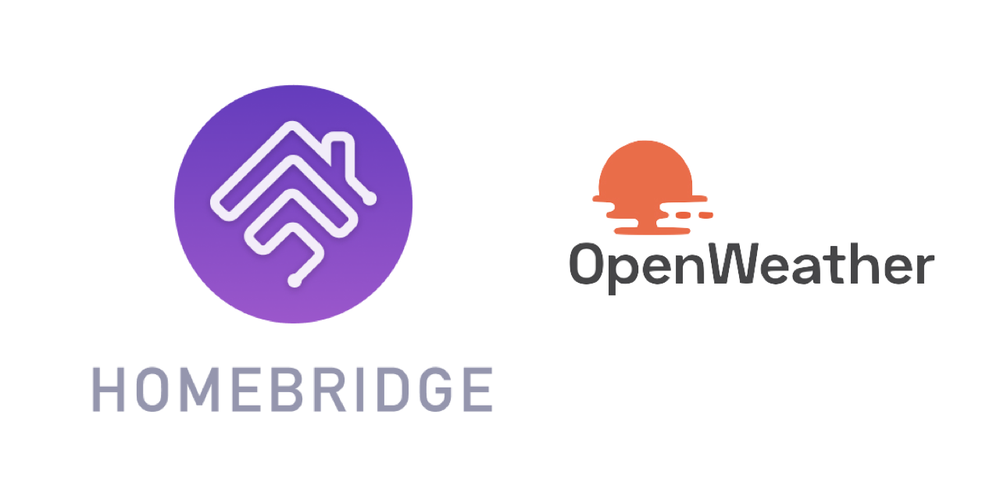

<p align="center">
    
</p>
<span align="center">

# Homebridge WS
[](https://www.npmjs.com/package/homebridge-ws)
[](https://www.npmjs.com/package/homebridge-ws)
[](https://standardjs.com)
[](https://discord.gg/hZubhrz)
[](https://github.com/ebaauw/homebridge-ws/issues)
[](https://github.com/ebaauw/homebridge-ws/pulls)

</span>

## Homebridge plugin for virtual weather station
Copyright © 2018-2020 Erik Baauw. All rights reserved.

This [Homebridge](https://github.com/homebridge/homebridge) plugin exposes one or more virtual weather stations to Apple's [HomeKit](http://www.apple.com/ios/home/).  Each station mimics an Eve Degree, providing separate services for Temperature, Humidity, and Air Pressure.  Temperature and Humidity are supported Apple's [Home](https://support.apple.com/en-us/HT204893) app and by Siri.  For Air Pressure you need another app, like like [Eve](https://www.evehome.com/en/eve-app).  In Eve, you also get history for Temperature, Humidity and Air Pressure.  The weather is retrieved from [OpenWeatherMap](https://openweathermap.org).

There's many other weather station plugins out there.  I created this one for fun and for testing plugin designs.  In particular, this plugin is the launching plugin for [homebridge-lib](https://github.com/ebaauw/homebridge-lib).

### Prerequisites
You need to obtain an [API key](https://openweathermap.org/price) from OpenWeatherMap.
The free tier of the _Current weather and forecasts collection_ will do just fine.

You need a server to run Homebridge.
This can be anything running [Node.js](https://nodejs.org): from a Raspberry Pi, a NAS system, or an always-on PC running Linux, macOS, or Windows.
See the [Homebridge Wiki](https://github.com/homebridge/homebridge/wiki) for details.
I run Homebridge ZP on a Raspberry Pi 3B+.

To interact with HomeKit, you need Siri or a HomeKit app on an iPhone, Apple Watch, iPad, iPod Touch, or Apple TV (4th generation or later).
I recommend to use the latest released versions of iOS, watchOS, and tvOS.  
Please note that Siri and even Apple's [Home](https://support.apple.com/en-us/HT204893) app still provide only limited HomeKit support.
To use the full features of Homebridge Zp, you might want to check out some other HomeKit apps, like the [Eve](https://www.evehome.com/en/eve-app) app (free) or Matthias Hochgatterer's [Home+](https://hochgatterer.me/home/) app (paid).  

### Installation
To install Homebridge WS:
- Follow the instructions on the [Homebridge Wiki](https://github.com/homebridge/homebridge/wiki) to install Node.js and Homebridge;
- Install the Homebridge WS plugin through Homebridge Config UI X or manually by:
  ```
  $ sudo npm -g i homebridge-ws
  ```
- Edit `config.json` and add the `WS` platform provided by Homebridge WS, see [**Configuration**](#configuration).

### Configuration
In Homebridge's `config.json` you need to specify Homebridge WS as a platform plugin.
Furthermore, you need to specify your OpenWeatherMap [API key](https://openweathermap.org/price), and [location(s)](https://openweathermap.org/current):
```json
  "platforms": [
    {
      "platform": "WS",
      "name": "Weather",
      "apikey": "xxxxxxxxxxxxxxxxxxxxxxxxxxxxxxxx",
      "locations": ["Amsterdam"]
    }
  ]
```

### Caveats
Homebridge WS is a hobby project of mine, provided as-is, with no warranty whatsoever.  I've been running it successfully at my home for years, but your mileage might vary.

The HomeKit terminology needs some getting used to.
An _accessory_ more or less corresponds to a physical device, accessible from your iOS device over WiFi or Bluetooth.
A _bridge_ (like Homebridge) is an accessory that provides access to other, bridged, accessories.
An accessory might provide multiple _services_.
Each service corresponds to a virtual device (like a lightbulb, switch, motion sensor, ..., but also: a programmable switch button, accessory information, battery status).
Siri interacts with services, not with accessories.
A service contains one or more _characteristics_.
A characteristic is like a service attribute, which might be read or written by HomeKit apps.
You might want to checkout Apple's [HomeKit Accessory Simulator](https://developer.apple.com/documentation/homekit/testing_your_app_with_the_homekit_accessory_simulator), which is distributed as an additional tool for `Xcode`.
